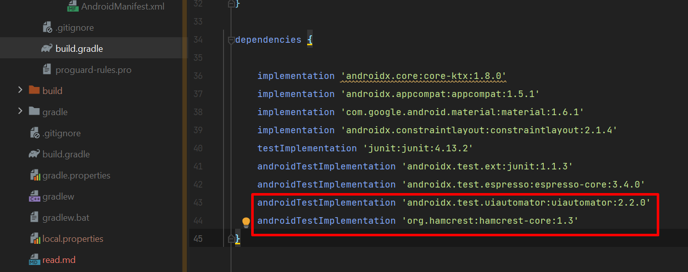

## Использование тестов:

- положить ``hwchecker.jar, HW1C.class`` в одну папку
- создать файл в этой же папке ``HW1.properties`` с содержимым (пример):
```
0=button0
1=button1
2=button2
3=button3
4=button4
5=button5
6=button6
7=button7
8=button8
9=button9
.=buttonDot
+=buttonPlus
-=buttonMinus
*=buttonMultiply
/=buttonDivide
==buttonEquals
arg1=inputText
arg2=inputText
res=resultText
```
``0`` - это название кнопки, а ``button0`` - это id кнопки в xml-файле,  
``arg1`` - это id поля ввода первого аргумента  
``arg2`` - это id поля ввода второго аргумента (arg1 и arg2 могут быть одинаковыми)  
``res`` - это id поля вывода результата (так же может быть одинаковым с arg1 и arg2)
- запустить эмулятор или подключить устройство (при подключении устройства необходимо включить режим разработчика 
и разрешить отладку по USB), пример в скриншотах ниже (надеюсь как включить режим разработчика все разберутся)


 
#### Для запуска через телефон здесь должно быть указано ваше устройство (также телефон должен быть разблокирован):


#### Для запуска через эмулятор должно выглядеть примерно так (можно загуглить как включить эмулятор в Android Studio):


[Гайд по запуску эмулятора](https://tunecom.ru/virtual-machines/390-ispolzuem-android-studio-v-kachestve-jemuljatora-smartfona.html)
(листаем до "Как настроить и запустить эмулятор Android Studio")

- в dependencies в build.gradle файле добавить  
``androidTestImplementation 'androidx.test.uiautomator:uiautomator:2.2.0'``  
``androidTestImplementation 'org.hamcrest:hamcrest-core:1.3'``



- запустить через консоль: ```java -jar hwchecker.jar HW1C {directory}```  
где {directory} - путь к вашему проекту.


